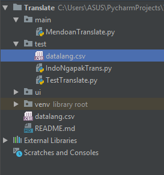

# Translate
This project about makes translator among `Indonesia`, `English`, `Japan`, and `Ngapak` using `Google Translator API` and Local data which collect by our team for `Ngapak` Language.
this project purpose to Artificial Intelligence programme

## Library

### csv
this project need csv library for read `datalang.csv` to fetch data and restored to array
import
```python
import csv
```
usage
```python
import csv

id = [] # variable for restored csv index 0 or Indonesia Language
ng = [] # variable for restored csv index 1 or Ngapak Language

with open('datalang.csv') as csvDataFile:
    csvReader = csv.reader(csvDataFile)
    for row in csvReader:
        id.append(row[0])
        ng.append(row[1])
```

### Translator
this library for translate to other language using `API`
import
```python
from translate import Translator
```
usage

translate to target destination language using key `to_lang`
with default language is English `en`
```python
from translate import Translator
engTrans = Translator(to_lang="id")
try:
    engTxt = engTrans.translate("Hello World!")
    self.txtTo.setText(engTxt)
except:
    self.txtTo.setText("Please try again...")
```
or to more specific language using 2 digit language code or ISO 639-1 codes, you can find out
more language code here [ISO 639-1]("https://en.wikipedia.org/wiki/List_of_ISO_639-1_codes")  
```python
from translate import Translator
engTrans = Translator(from_lang="id", to_lang="en")
try:
    engTxt = engTrans.translate("Halo Dunia!")
    self.txtTo.setText(engTxt)
except:
    self.txtTo.setText("Please try again...")
```

## Contribution
if you wonder how can I contribute to this project, you can clone and contribute Ngapak Language
by fill up our vocabulary called `datalang.csv` on `test` package or

### Data Ngapak - Indonesia Language 
Data Language:  [datalang.csv]("https://github.com/derysudrajat/Translate/blob/master/test/datalang.csv")



You can contribute to test our code using `Python` as the main language.

Indonesia - Ngapak Test : [IndoNgapakTrans.py]("https://github.com/derysudrajat/Translate/blob/master/test/IndoNgapakTrans.py")

Fully Test : [TestTranslate.py]("https://github.com/derysudrajat/Translate/blob/master/test/TestTranslate.py")


